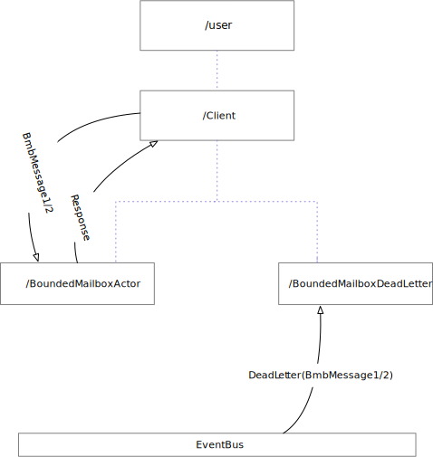

# Bounded mailbox tests

## Stage 1 - Bounded mailbox + event-bus Deadletters

We set-up 3 actors:

- `Client`: sends 10 messages to actor `BoundedMailboxDeadLetters`, 5 pairs of `BmbMessage1` and `BmbMessage2`, each pair separated by a 500ms interval
- `BoundedMailBoxActor`: this an actor configured with a bounded mailbox, configured with a mailbox capacity of 5 messages and the `mailbox-push-timeout-time` set to 0. With this setting, any message that would overflow the maibox capacity will end-up in dead-letters.
- `BoundedMailboxDeadLetters`: this actor subscribes to messages of type `DeadLetter`. Subsequently, upon receiving a `DeadLetter` message, it log the original message, the original sender (`Client` in this set-up) and the intended recipient (`BoundedMailBoxActor` in this test set-up)



To run this example, follow the following steps:

- From the root folder of the project, run `sbt`
- Select the project by running the command `project exercise_000_initial_state
- Follow the log by running `tail -f bmb.log`

```
 [ericloots@Eric-Loots-MBP] $ sbt
[info] Loading project definition from /Users/ericloots/Documents/ING-Model-Bank/BoundedMailBox/project
[info] Set current project to bounded_mailbox_master (in build file:/Users/ericloots/Documents/ING-Model-Bank/BoundedMailBox/)
[info] Set current project to exercise_000_initial_state (in build file:/Users/ericloots/Documents/ING-Model-Bank/BoundedMailBox/)
man [e] > mini-cluster > initial-state > projeman [e] > mini-cluster > initial-state > projeman [e] > mini-cluster > initial-state > projeman [e] > mini-cluster > initial-state > project exercise_000_initial_state
[info] Set current project to exercise_000_initial_state (in build file:/Users/ericloots/Documents/ING-Model-Bank/BoundedMailBox/)
man [e] > mini-cluster > initial-state > run
[info] Compiling 1 Scala source to /Users/ericloots/Documents/ING-Model-Bank/BoundedMailBox/exercise_000_initial_state/target/scala-2.12/classes...
[info] Running poc.boundedmailbox.Main
```

Which produces the following log output:

```
 [ericloots@Eric-Loots-MBP] $ tail -f bmb.log
10:33:34 INFO  [] - Slf4jLogger started
10:33:34 DEBUG [EventStream(akka://bmb-poc-system)] - logger log1-Slf4jLogger started
10:33:34 DEBUG [EventStream(akka://bmb-poc-system)] - Default Loggers started
10:33:34 INFO  [akka://bmb-poc-system/user/bmb-client/bounded-mailbox-actor] - BMB Received: BmbMessage1(1)
10:33:35 INFO  [akka://bmb-poc-system/user/bmb-client/dead-letter-monitor] - ~~~> Received dead letter: BmbMessage1(4) from Actor[akka://bmb-poc-system/user/bmb-client#-1590089893] with recipient = Actor[akka://bmb-poc-system/user/bmb-client/bounded-mailbox-actor#1801529134]
10:33:35 INFO  [akka://bmb-poc-system/user/bmb-client/dead-letter-monitor] - ~~~> Received dead letter: BmbMessage2(message-4) from Actor[akka://bmb-poc-system/user/bmb-client#-1590089893] with recipient = Actor[akka://bmb-poc-system/user/bmb-client/bounded-mailbox-actor#1801529134]
10:33:36 INFO  [akka://bmb-poc-system/user/bmb-client/dead-letter-monitor] - ~~~> Received dead letter: BmbMessage1(5) from Actor[akka://bmb-poc-system/user/bmb-client#-1590089893] with recipient = Actor[akka://bmb-poc-system/user/bmb-client/bounded-mailbox-actor#1801529134]
10:33:36 INFO  [akka://bmb-poc-system/user/bmb-client/dead-letter-monitor] - ~~~> Received dead letter: BmbMessage2(message-5) from Actor[akka://bmb-poc-system/user/bmb-client#-1590089893] with recipient = Actor[akka://bmb-poc-system/user/bmb-client/bounded-mailbox-actor#1801529134]
10:33:39 INFO  [akka://bmb-poc-system/user/bmb-client/bounded-mailbox-actor] - BMB Received: BmbMessage2(message-1)
10:33:39 INFO  [akka://bmb-poc-system/user/bmb-client] - Client received response: Response(1)
10:33:44 INFO  [akka://bmb-poc-system/user/bmb-client/bounded-mailbox-actor] - BMB Received: BmbMessage1(2)
10:33:44 INFO  [akka://bmb-poc-system/user/bmb-client] - Client received response: Response(message-1)
10:33:49 INFO  [akka://bmb-poc-system/user/bmb-client/bounded-mailbox-actor] - BMB Received: BmbMessage2(message-2)
10:33:49 INFO  [akka://bmb-poc-system/user/bmb-client] - Client received response: Response(2)
10:33:54 INFO  [akka://bmb-poc-system/user/bmb-client/bounded-mailbox-actor] - BMB Received: BmbMessage1(3)
10:33:54 INFO  [akka://bmb-poc-system/user/bmb-client] - Client received response: Response(message-2)
10:33:59 INFO  [akka://bmb-poc-system/user/bmb-client/bounded-mailbox-actor] - BMB Received: BmbMessage2(message-3)
10:33:59 INFO  [akka://bmb-poc-system/user/bmb-client] - Client received response: Response(3)
10:34:04 INFO  [akka://bmb-poc-system/user/bmb-client] - Client received response: Response(message-3)
```

As can be seen, starting with the 7th message (`BmbMessage1(4)`) all messages end-up in dead letters.
The first 6 messages are processed (the first message is processed _immediately_ and the subsequent 5 messages end-up in the mailbox and are processed eventually).